# Daniel Diyali

**CS @ Washington State University · Building toward AI Safety Research · AI/ML Fellow @ Break Through Tech**

---

## About

CS undergrad at WSU (Math minor, graduating May 2028), transferred from Green River College. Two active fellowships right now: AI/ML Fellow at Break Through Tech and Applied AI Engineering Fellow at CodePath. I also work as a Resident Advisor at WSU Housing.

Working toward AI safety research as a longer-term goal, targeting programs like MATS and the Anthropic Fellows program. Outside of coursework I build a lot through hackathons, usually solo, and I've got a solid winning record there.

---      

## Projects

| Project | What it does | Stack |
|---|---|---|
| [ai-safety](https://github.com/daniel-diyali/ai-safety) | Self-study roadmap toward AI safety fellowships — ARENA prerequisites, PyTorch, alignment fundamentals | Python, PyTorch |
| [Hallucination-Eval](https://github.com/daniel-diyali/Hallucination-Eval) | Evaluation harness scoring LLM outputs for faithfulness against HaluEval-QA | HuggingFace, DeBERTa-MNLI |
| [fastapi-rag](https://github.com/daniel-diyali/fastapi-rag) | RAG system over FastAPI docs with a pluggable embedder architecture | FastAPI, ChromaDB, sentence-transformers |
| [Tell](https://github.com/daniel-diyali/Tell) | Webcam-based fatigue and posture detection, built solo at QuackHacks 3.0 | MediaPipe, Gemini 2.5 Pro, ElevenLabs, Firebase |
| [TREADMAPS](https://github.com/daniel-diyali/TREADMAPS) | Gemini-powered route recommender with a Snowflake data layer | FastAPI, TypeScript, Snowflake |
| [multi_agent_system](https://github.com/daniel-diyali/multi_agent_system) | Multi-agent architecture experiments | Python |
| [TutorFlow](https://github.com/daniel-diyali/TutorFlow) | Tutoring platform backend | Python, AWS Lambda, DynamoDB |

---

## Stack

`Python` `FastAPI` `React` `PyTorch` `scikit-learn` `LangChain` `FAISS` `AWS` `Snowflake` `LLM APIs`

---

## Stats

---

[GitHub](https://github.com/daniel-diyali) · [LinkedIn](https://www.linkedin.com/in/danieldiyali/)

